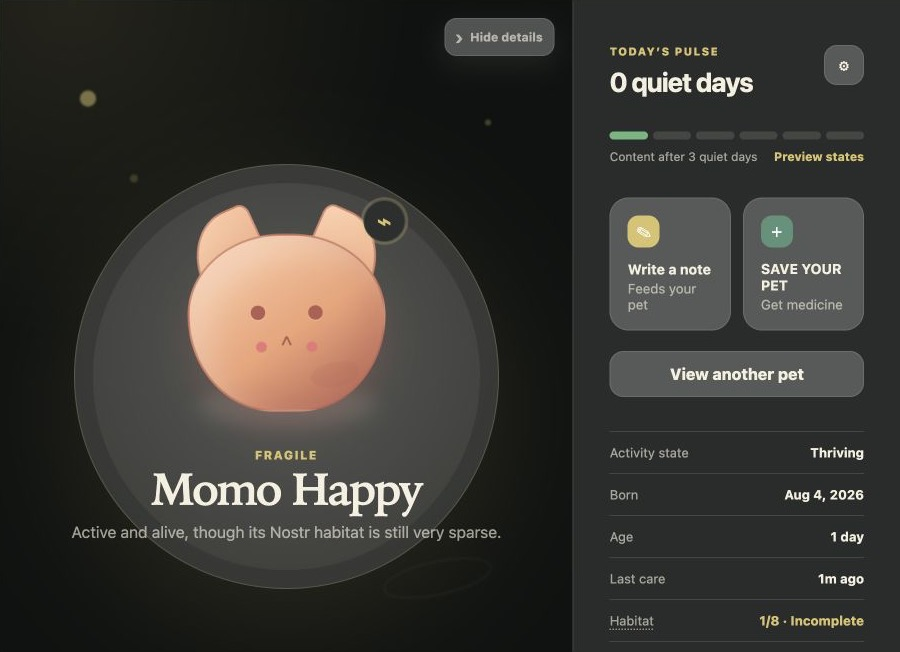
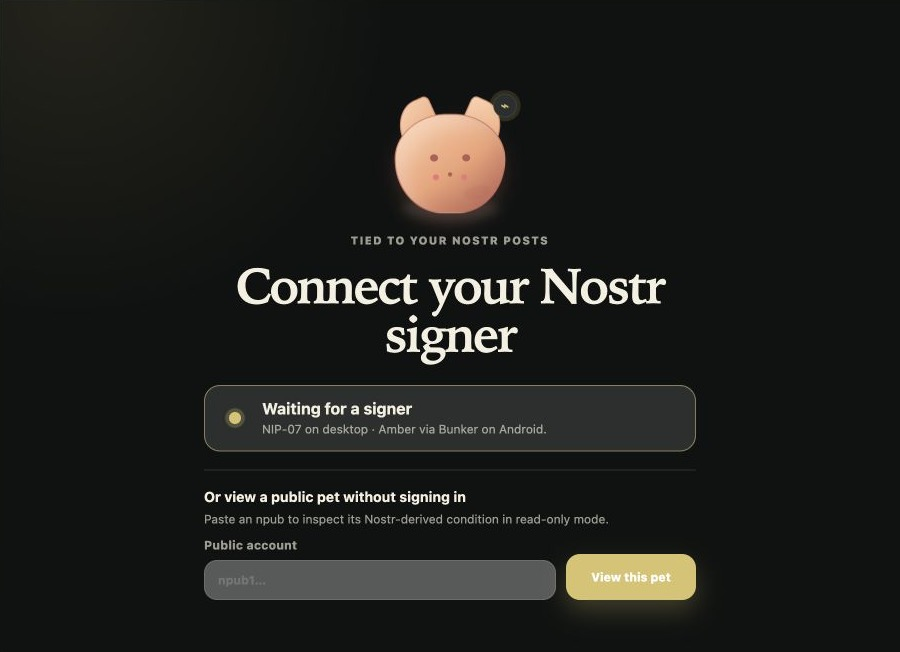
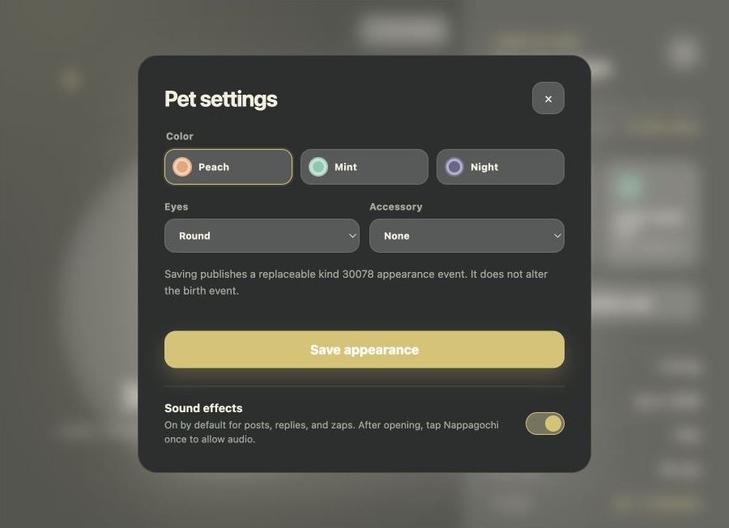
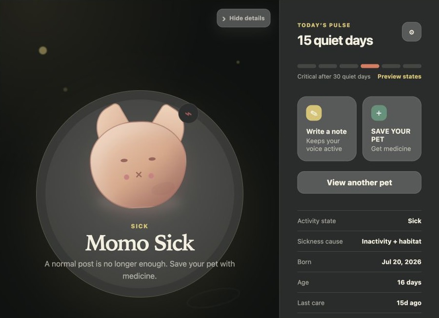
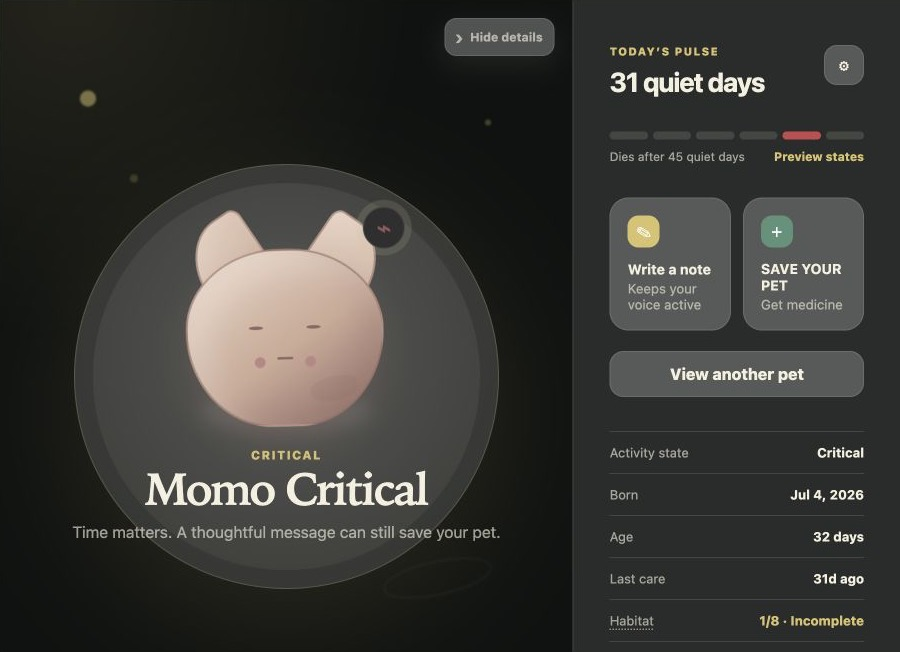
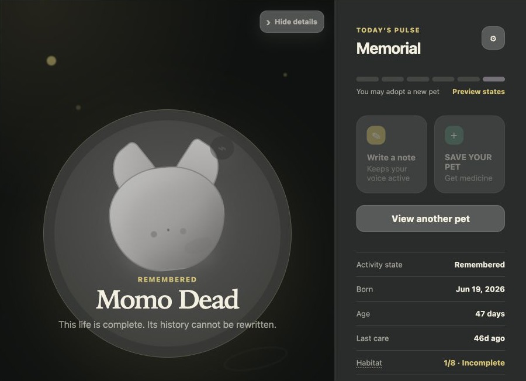

# Nappagochi

**A small life tied to your Nostr posts.**

Nappagochi is a sandboxed Nostr napplet that turns public activity and profile
health into the changing life of a desktop pet. Post, reply, care for its
habitat, and watch it react in real time.



[Open the current release in Kehto Paja](https://kehto.github.io/web/paja/?naddr=naddr1qvzqqqyf8ypzqte9nen2lgah6szky3hr0ympcj5v3znps9umamlzsm53fxn9ynyxqyxhwumn8ghj7mn0wvhxcmmvqy28wumn8ghj7un9d3shjtnyv9kh2uewd9hsz9nhwden5te0wfjkccte9ec8y6tdv9kzumn9wsqqjmn0wd68yttsv46qhg7xxf)

## Meet your pet

Connect with a Nostr signer to care for your own pet, or paste a public `npub`
to view another pet without signing in. Appearance settings let each owner
choose a color, eyes, accessory, and sound preference.

<table>
  <tr>
    <td width="50%"></td>
    <td width="50%"></td>
  </tr>
  <tr>
    <td align="center"><strong>Connect or visit</strong></td>
    <td align="center"><strong>Make it yours</strong></td>
  </tr>
</table>

## A life with consequences

As quiet days accumulate, a pet can become Lonely, Sick, Critical, and finally
Remembered. Sick and Critical pets need a meaningful reply to another person
to recover. Death is permanent for that pet, but its owner can adopt a new
successor.

<table>
  <tr>
    <td width="33%"></td>
    <td width="33%"></td>
    <td width="33%"></td>
  </tr>
  <tr>
    <td align="center"><strong>Sick</strong></td>
    <td align="center"><strong>Critical</strong></td>
    <td align="center"><strong>Remembered</strong></td>
  </tr>
</table>

## How it works

- A signed kind `78` event creates a pet and records its birth.
- Top-level kind `1` notes feed a living, non-sick pet.
- Kind `1` replies to another author act as medicine for Sick or Critical pets.
- Long inactivity progresses through Lonely, Sick, Critical, and Dead.
- Death is terminal for that pet; its owner may create a successor.
- Kind `30078` stores replaceable appearance settings without rewriting birth.
- An eight-check habitat score, inspired by
  [Gigi's Profile Health project](https://github.com/dergigi/napplet-workshop/tree/master/profile-health),
  adds a second Sick trigger after 14 continuous Incomplete days.

## Live reactions

While it is open in a compatible NIP-5D shell, Nappagochi listens for new
owner activity and incoming zap receipts through NAP-OUTBOX. Kind `1` posts,
kind `1` replies, and validated NIP-57 zaps each trigger their own animation,
sound, and speech. The pet then refreshes its canonical Nostr-derived
condition.

These live reactions are visual feedback only: they never override the pet's
authoritative lifecycle or health state.

## Keyboard integration

When the shell provides NAP-KEYS, `Alt+P` is offered as an optional binding for
showing or hiding the pet care panel. The visible panel button remains the
fallback. NAP-KEYS smart forwarding keeps input, textarea, select, and
contenteditable keystrokes inside the napplet instead of forwarding typed text
to the shell.

## Run locally

```bash
pnpm install
pnpm run verify
pnpm run test:conformance
```

The production build is a single self-contained `dist/index.html`. Use Paja or
another NIP-5D-compatible shell for an interactive preview; the Vite page alone
does not provide the napplet runtime.

To start a development environment that uses the shell-provided NAP-OUTBOX API:

```bash
pnpm dev
```

To start the local relay, Vite server, and Paja debug environment together:

```bash
pnpm demo:local
```

## Demo fixtures

```bash
pnpm run test:fixtures
pnpm run test:fixtures:matrix
```

The fixture tools create disposable, signed test accounts for every lifecycle
state. Generated keys and relay data stay in the gitignored `.pet-test/`
directory and must never use a real identity or a key controlling funds.

## Napplet boundaries

- Required NAP domains: `identity` and `outbox`.
- Optional NAP-KEYS action: `pet.toggle-care-panel`; the panel button is the
  fallback when `keys` is unavailable.
- Normal Nostr reads and publishes are OUTBOX-first.
- Signing, relay discovery, validation, and fanout belong to the shell.
- The napplet never handles private keys or uses direct browser network access.
- The existing `nostr-pet` manifest and event metadata remain unchanged so
  previously created pets continue to load.

## License

[MIT](LICENSE)
